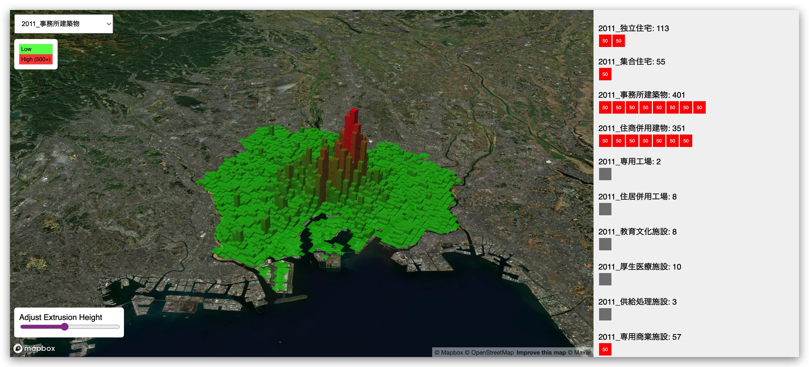
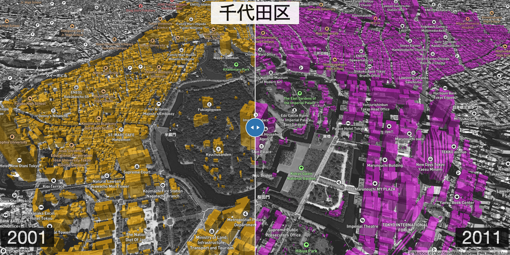

# Gallery of exhibits

Explore our exhibits that reveal Tokyo's dynamic urban transformations over the past 20 years. Click on any exhibit to dive deeper into the data and visuals.

---

## Featured exhibits

	

		<a href="exhibit1" title="Explore Redevelopment in Central Tokyo">
			

				
			

			<h3>Exhibit #1</h3>
			
Redevelopment in Central Tokyo

		</a>
	

	

		<a href="exhibit2" title="Discover Changing Land Use in Suburban Tokyo">
			

				
			

			<h3>Exhibit #2</h3>
			
Changing Land Use in Suburban Tokyo

		</a>
	

	

		<a href="exhibit3" title="View Economic Projections of Urban Spaces">
			

				
			

			<h3>Exhibit #3</h3>
			
Chiyoda 2011 -> 2011

		</a>
	

	

		<a href="exhibit4" title="How has Tokyo's land use changed since 1996?">
			

				
			

			<h3>Exhibit #4</h3>
			
How has Tokyo's land use changed since 1996?

		</a>
	

